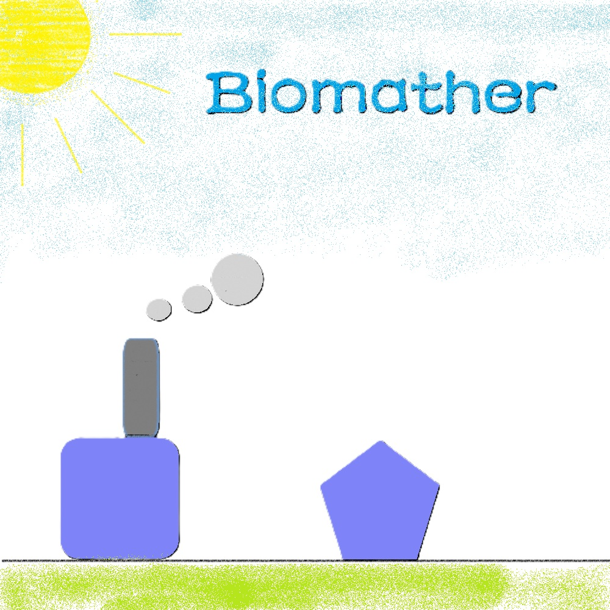

<p align="center">
    
</p>
<h1 align="center">Biomather 贡献指南</h1>

<p align="center" class="language" title="Language selection 语言选择">
  <a href="docs/Contributing_en_us.md">English(American)</a>  | 
  <b>简体中文</b> | 
  <a href="docs/Contributing_fr_fr.md">Français</a>|
  <a href="docs/Contributing_zh_tw.md">繁體中文</a>
</p>

# 贡献指南

我们鼓励每个人为Biomather APP贡献内容。

若您想贡献本仓库，那您必须仔细阅读并遵守以下内容。在您开始之前，请务必仔细阅读本指南、认真理解本指南的所有内容。您还应当注意本指南中**加粗的文字**和[开发规范](#开发规范)章节的内容。

## 可贡献类型

> ### 图标贡献

> 如果任何人想贡献图标，请仔细阅读[icons-about.md](./icons/icons-about-zh.md)文件了解如何贡献。

> ### 代码贡献

> 如果任何人想贡献代码，则请仔细阅读以下章节的内容。

## 基本流程

下面是贡献本仓库所需的基本步骤。

1. 您可以寻找可改善的任何东西，包括但不限于代码、图标、文档等进行改进。

2. 然后与我们取得联系，并告知我们您想贡献的内容，在得到我们的同意后，您可以参与此仓库的贡献。

3. 您先将此仓库Clone到本地。

##### （如果你是组织成员可以直接上传至仓库）

4. 在本地进行修改，并提交到您的仓库。修改完成后，在我们组织的仓库中创建一个Pull Request。

5. 等待我们审核您的Pull Request，若通过则合并。

> [!TIP]
> 在此过程中请尽量使用Git命令行、Github Desktop等方式进行提交。

## 重要提醒

* 若您认为您的修改具有一定重要性或量级时，请按照以下格式阐述更新内容并及时在[更新日志](./Security)中添加相关内容：
  
      ```
      v1.4.0 (2025-12-31)
      (更新来自 @Somebody)
      - 更新了...
      - 优化了...
      - 修复了...
      ...
      
      ```

> [!TIP]
> 
> 1. 标题应带有版本号、主要更新内容。
> 2. 内容第一行应注明更新来源。
> 3. 内容应需使用用列表的方式阐述更新内容。

> [!NOTE]
> 
> 1. **请不要**任意选取版本号。若您不熟悉版本号的规则，请通过[创建者邮箱](mailto:www.jiang090322@outlook.com)或在github上新建一个[issues](https://github.com/Jourious/biomather-pubilc/issues)与我们取得联系并分配版本号。
> 2. 在更新时，**记住**要在“关于 biomather APP”应用的更新记录中，添加关于该更新的相关内容。
> 3. 若您的修改具有一定重要性或量级时，请在更新记录中添加相关内容。

* 根据中华人民共和国有关法律的规定,您**不可以**通过本项目传播违法和违规内容，否则，一旦发现，我们将会采取**锁定+视情况封禁**的处理，同时我们保留在任何时间以一切方式采取法律行动、追究法律责任的权利。

* 您知情并同意：**为使得您贡献的内容得到更好的分享及推广，就您在本项目所贡献的内容，您授权我们一项全球范围内的、免费的、非独家的、可再许可的权利；该等内容包括但不限于文字作品、美术作品、图形作品、视听作品、计算机程序源代码等各种著作权法意义上构成“作品”的内容；该等权利包括但不限于复制、翻译、整理、汇编、注释、改编、信息网络传播、发行等各项著作权及其相关权利，且该等权利应至少涵盖对于“biomather APP”项目或以其他方式开发相关内容的一部分或全部的权利及许可。**
## 开发规范
### 关于Python的开发规范

1. 我们对于内部测试的Python文件有如下规定规定
   
   * 1. 开头的规范
        详见 `app-bate-v0.1.0.py`([点击跳转](./app-py/app-bate-v0.1.0.py)) 开头的代码规范，务必认真阅读。
   
   * 2. 请按照以下代码风格进行开发：
   
   ```python
      sum = 0
      for i in range(10):
         sum = sum + i
      print(sum)
   ```
   
   * 3. 对于函数名及变量命名，请使用下划线命名法，如：
        *  user_name
        *  user_password
        *  user_age
   
   * 4. 对于类名或模块名，请使用驼峰式命名法，如：
        *  jsonParser
        *  widget
   
   * 5. 对于其他的代码规范的规定：
        
        * 1. 对于那些不需要展开的代码，尽量压成一行
        
        * 2. 对于那些需要增添缩进的行，请务必保持缩进为4个空格
        
        * 3. 对于行间注释，请使用#开头，并与需注释的代码保持在同一行，如：
             ```python
             sum = 0  # 这是一个注释 ```
        
        * 4. 对于函数及类的注释，请使用"""开头,并单独占用一或多行行，如：
             
             ```python
             def func():
             """
             这是一个函数
             """
             print("hello world")
             ```

### 关于C++的开发规范

* 注意：使用C++开发的版本属于公共测试版或正式版，因此请务必认真对待C++的开发

* 提醒：当前C++的版本还未开发，如果您想贡献C++代码，请务必与我们取得联系，确认您所做的开发不与其他人重复。
1. 关于头文件我们有如下规定：
    请务必使用以下格式编写头文件：
   
   ```cpp
   #ifndef __HEADER_H__
   #define __HEADER_H__
   ```

2. 关于C++的代码风格，请按照如下的示例进行开发：
   
   ```cpp
   #include <iostream>
   using namespace std;
   
   void massage(), line();
   
   int main()
   {
       cout << "maybe I hate writing C++!" << endl;
       massage();
       line();
       cout << "this is too difficult to learn !" << endl;
       line();
       return 0;
   }
   
   void massage()
   {
       cout << "C++ is a language that too many people dislike to learn !" << endl;
   }
   
   void line()
   {
       cout << "------------------------------------------" << endl;
   }
   ```

3. 对于函数名，变量名，类名以及模块名的命名，请保持与Python的开发规范一致。（不在此赘述）

4. 对于其他的规范，我们有如下规定：
   
   * 1. 第一至二点与上文提到的Python的开发规范保持一致。
   
   * 2. 对于行间注释，请使用//开头，并与需注释的代码保持在同一行，如：
        
        ```cpp
        int sum = 0; // 这是一个注释
        ```
   
   * 3. 对于函数及类的注释，请使用/** 开头,并以*/结束，可以使用多行或仅一行注释如：
        
        ```cpp
        /**
        * 这是一个函数
        */
        void func()
        {
           cout << "hello world" << endl;
        }
        ```
